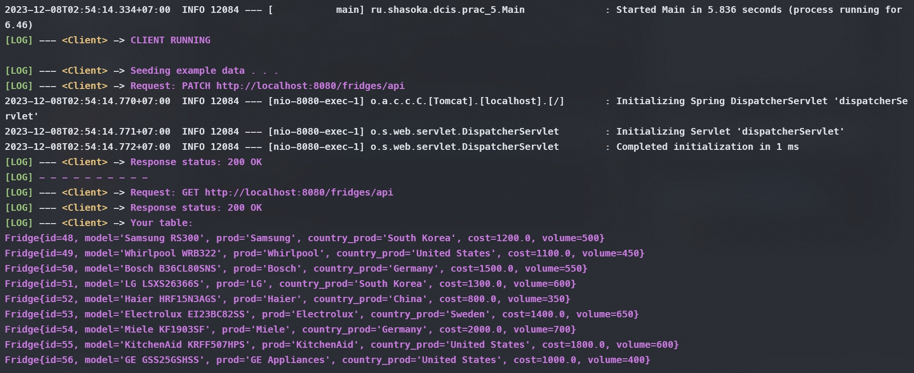
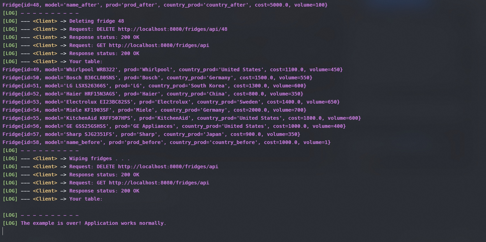
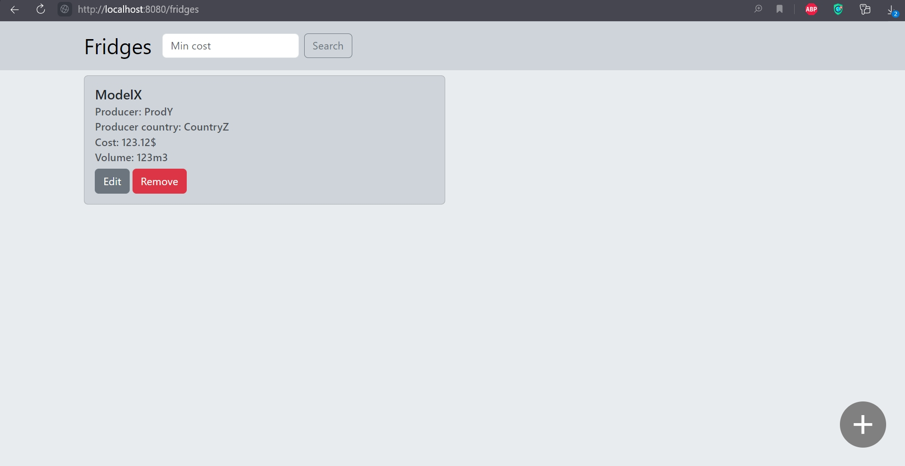

# Практическая работа №7

## Архитектура REST

**Цель**: ознакомиться с механизмами поддержки архитектуры REST в Spring.

**Общая постановка задачи**: Изменить приложение из практического задания №6 (или №5, на усмотрение студента, т.к. при работе с защищенным приложением могут возникнуть трудности) и добавить следующий функционал:

1) Преобразовать веб-приложение таким образом, чтобы оно поддерживало архитектуру REST. Должны поддерживаться следующие типы запросов: GET (показ html и извлечение json всех/одной записей/сущностей), POST (добавление), PUT (редактирование), DELETE (удаление).
2) Разработать REST-клиент для приложения, который с использованием RestTemplate позволяет выполнять базовые операции по извлечению (GET), добавлению (POST), редактированию (PUT), удалению (DELETE) ресурсов. REST-клиент не обязан иметь графический пользовательский интерфейс, необходим репрезентативный тестовый пример, который можно запускать из окна терминала.
3) Обязательным условием является сохранение всего предшествующего функционала приложения. Для удовлетворения всем характеристикам REST- архитектуры приложение может быть реорганизовано (убраны GET-запросы с параметрами) или добавлен новый функционал.
4) PUT- и DELETE-запросы не обязательно делать из браузера. Достаточно реализации для клиентов-приложений.

## Результат работы

**Вариант 6**. Сущность: Холодильник.

**Инструкция по сборке и запуску проекта**:
> В pom.xml и в логах сборки может фигурировать артефакт prac_5. Все в порядке, просто делал эту работу поверх предыдущей.
1. [Загрузите содержимое папки prac_7](https://disk.yandex.ru/d/j-FrxB5lCa2V1w) (ресурс DownGit сломался, к сожалению, ссылка ведет на Яндекс Диск);
2. В файле ```src/resources/application.properties``` замените пароль или имя пользователя для подключения приложения к БД (```spring.datasource.password=postgres``` или ```spring.datasource.username=postgres```);
3. Запустите .sql скрипт, который создаст базу данных с одной таблицей, необходимой для работы проекта:
   ```
   psql -U postgres -h localhost -f deploy.sql
   ```
4. Выполните сборку .jar командой (```-Dallow.run=false``` - параметр, отменяющий запуск клиента при сборке):
    ```
    mvnw clean package -Dallow.run=false
    ```
5. Запустите .jar:
    ```
    java -jar target/prac_5-0.0.1-SNAPSHOT.jar -Dallow.run=true
    ```
6. После запуска сервера запускается клиент, демонстрирующий работу REST запросов. На рисунках ниже показан пример того, как выглядит работа клиента.

Рисунок 1 - Начало работы клиента после запуска сервера

Рисунок 2 - Окончание работы клиента и ожидание дальнейшего взаимодействия
7. Теперь можем пойти на [localhost:8080](http://localhost:8080/) и взаимодействовать с приложением в браузере.

Рисунок 3 - Сохраненный функционал приложения из практической работы №5
8. Победа! ✌️
