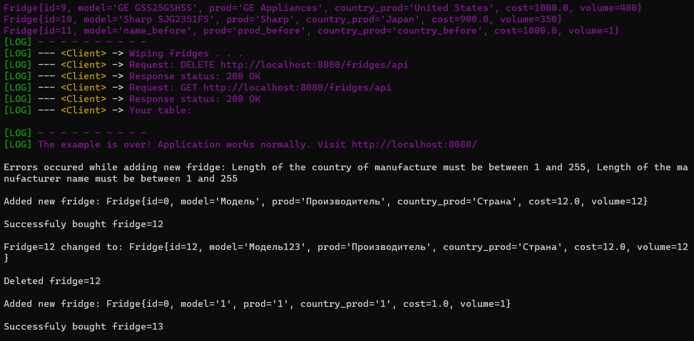

# Практическая работа №8 (Модификация работы №7, пункты 5 и 6 не реализованы)

## Spring JMS

**Цель**: ознакомиться с механизмом JMS в Spring.

**Общая постановка задачи**: Изменить приложение из практического задания №7, №6 или №5 (на усмотрение студента) и добавить следующие возможности (пункты со "снежинкой" желательны, но не обязательны):
1) Настроить очередь (Для ActiveMQ или любого другого брокера сообщений JMS) приема сообщений для администратора.
2) При выполнении операций добавления, удаления или редактирования ресурса через REST API / форму создавать соответствующие уведомления и отправлять их в очередь.
3) Любым удобным способом (можно через терминал) продемонстрировать извлечение административных сообщений о выполненных операциях (из п.2).
4) Добавить кнопку-ссылку «купить» на форме. После этого в брокер сообщений отправляется сообщение о том, какой «товар»/сущность хочет купить пользователь.
5) *В п.4 "товар" помечается как купленный и не будет показан в общем списке товаров. Необходимо добавить соответствующий столбец, или просто удалить запись о купленном товаре из БД, но перед этим не забыть отправить информацию о товаре в брокер сообщений.
6) *Реализовать приложение-сервис приемки сообщений, которое принимает сообщение и на основе содержимого сообщения отправляет e-mail администратору по некоторому адресу (можно использовать константную строку вашего почтового ящика в домене СФУ) о том, что у него хотят купить товар.

## Результат работы

**Вариант 6**. Сущность: Холодильник.

**Инструкция по сборке и запуску проекта**:
1. [Загрузите содержимое папки prac_8](https://minhaskamal.github.io/DownGit/#/home?url=https://github.com/shasoka/dcis/tree/master/practice/prac_8);
2. В файле ```src/resources/application.properties``` замените пароль или имя пользователя для подключения приложения к БД (```spring.datasource.password=postgres``` или ```spring.datasource.username=postgres```);
3. Запустите .sql скрипт, который создаст базу данных с одной таблицей, необходимой для работы проекта:
   ```
   psql -U postgres -h localhost -f deploy.sql
   ```
4. Выполните сборку .jar командой (```-Dallow.run=false``` - параметр, отменяющий запуск клиента при сборке):
    ```
    mvnw clean package -Dallow.run=false
    ```
5. Перед запуском .jar необходимо запустить ActiveMQ брокер. Это можно сделать или "вручуню", запустив ```activemq.bat```, хранящийся у Вас локально, или выполнив команду:
   ```
   activemq start
   ```
   Если вы добавили папку bin из каталога с ActiveMQ в PATH.
6. Запустите .jar:
    ```
    java -jar target/prac_8-1.0-SNAPSHOT.jar -Dallow.run=true
    ```
7. После запуска сервера запускается клиент (функционал из работы №7), затем можно перейти на http://localhost:8080/.
8. Получение сообщений о событиях на сайте было реализовано НЕ через REST API (см. ```src/main/java/ru/shasoka/dcis/prac_8/controllers/FridgeController```). После добавления нового холодильника, редактирования или удаления уже существующего, а также после нажатия на кнопку "Buy", администратор получает соответствующие сообщения в терминале (рис. 1). Обработчик сообщений запускается отдельным потоком и проверяет очередь раз в 100 миллисекунд. 

9. Победа! ✌️
